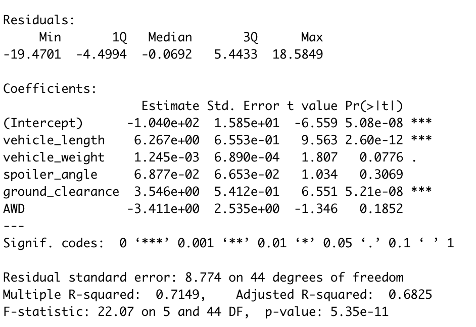
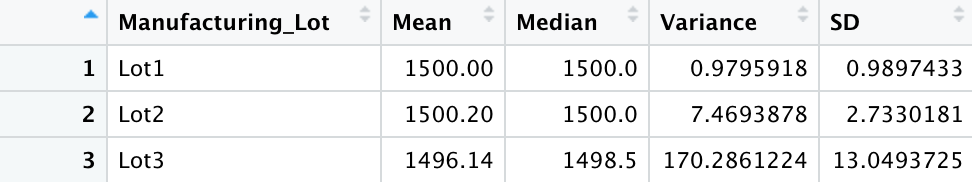
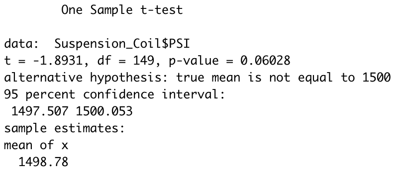
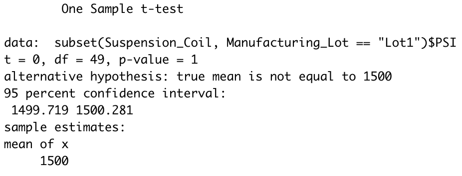
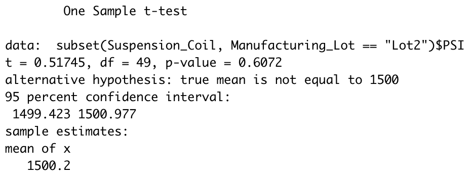
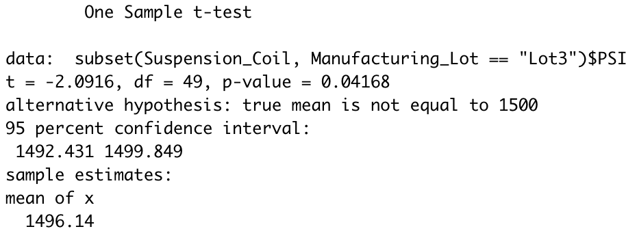

# MechaCar Statistical Analysis
## Purpose
A few weeks after starting his new role, Jeremy is approached by upper management about a special project. AutosRUs’ newest prototype, the MechaCar, is suffering from production troubles that are blocking the manufacturing team’s progress. AutosRUs’ upper management has called on Jeremy and the data analytics team to review the production data for insights that may help the manufacturing team.

In this challenge, you’ll help Jeremy and the data analytics team do the following:

 - Perform multiple linear regression analysis to identify which variables in the dataset predict the mpg of MechaCar prototypes
 - Collect summary statistics on the pounds per square inch (PSI) of the suspension coils from the manufacturing lots
 - Run t-tests to determine if the manufacturing lots are statistically different from the mean population
 - Design a statistical study to compare vehicle performance of the MechaCar vehicles against vehicles from other manufacturers. For each statistical analysis, you’ll write a summary interpretation of the findings.

## Linear Regression to Predict MPG

* Which variables/coefficients provided a non-random amount of variance to the mpg values in the dataset?
    * Vehicle length and ground clearance provide non-random amounts of variance and have a statistical significant impact on miles per gallon of the prototypes. On the other hand, the vehicle weight, spoiler angle, and all wheel drive variables have p-values greater than 0.05, indicating a random amount of variance to the mpg values. 
* Is the slope of the linear model considered to be zero? Why or why not?
    * When considering a p-value significance of 0.05, this model’s p-value falls significantly underneath that threshold. Therefore, there is significant evidence to reject the null hypothesis that the variance in the mpg of the prototypes is due to random chance. Due to this rejection, we can safely assume the linear model is not zero. 
* Does this linear model predict mpg of MechaCar prototypes effectively? Why or why not?
    * While not a perfect prediction, our current linear model has an r-squared value of 0.7149, indicating up to 71% of all mpg predictions can be determined by this model. This is a significant amount of predictions, indicating our model can predict mpg of prototypes rather effectively.

## Summary Statistics on Suspension Coils

### Total Summary

### Lot Summary

* The design specifications for the MechaCar suspension coils dictate that the variance of the suspension coils must not exceed 100 pounds per square inch. Does the current manufacturing data meet this design specification for all manufacturing lots in total and each lot individually? Why or why not?
    * Looking at the entire production lot population, the variance falls within the 100 pounds per square inch (PSI) threshold at 62.29 PSI. However, when grouped by lot, we noticed that most of this variance is driven by the coils in Lot 3. While the variance in Lots 1 and 2 easily fall within the design specifications with variances of 0.98 and 7.50, the coils in Lot 3 have a variance of 170.29, far exceeding the 100 PSI threshold. 

## T-Tests on Suspension Coils

### Total Sample

- When comparing our combination of all manufacturing lots to the presumed population mean of 1500, we see the true mean of our sample is 1498.78. With a p-value of 0.06, our full sample mean just meets the 0.05 threshold to avoid enough evidence in rejecting the null hypothesis that the mean of our total sample is statistically different to the presumed population mean. In other words, our total sample is statistically similar to the presumed population mean of 1500. 

### Lot 1

- When comparing Lot 1 to the presumed population mean of 1500, we see this lot actually has a true sample mean of 1500. Additionally, this lot has a p-value of 1, meaning we clearly cannot reject the null hypothesis as this observed sample mean and the presumed population mean are identical. 

### Lot 2

- When comparing Lot 2 to the presumed population mean of 1500, we see this lot also avoids rejection of the null hypothesis with a actual sample mean of 1500.02 and a p-value of 0.61, well above the 0.05 threshold to reject the null hypothesis.

### Lot 3

- When comparing Lot 3 to the presumed population mean of 1500, we first see a legitimate statistical difference. The sample mean is 1496.14 and the p-value is 0.04, just underneath are statistical significance threshold of 0.05. This means we can reject the null hypothesis that this sample and the population mean of 1500 are not statistically different. It’s obvious that this lot needs to be inspected as it could be skewing results. 

## Study Design: MechaCar vs Competition
To conduct an effective study comparing the MechaCar cars versus their competitors, we would fist need to compile a list of comparable models and decide what metrics most affect selling price. A few key metrics to look at would be:

Metrics 
- Fuel Efficiency: MPG on both the highway and in the city
- Safety Rating
- Engine type (Electric vs Gasoline vs Hybrid)
- Manufacturing Cost
- Maintenance Frequency
- Current Selling Price

Hypothesis:
- Null Hypothesis: Given the above metrics, MechaCar models are equitable in both pricing and standards to their competitors.
- Alternative Hypothesis: Given the above metrics, MechaCar models are NOT equitable in both pricing and standards to their competitors.

Statistical Test:
- The first statistical test would be a correlation analysis to see which independent variables have the highest r-values when compared to the current sales price dependent variable. 
- The next statistical test would be a multiple linear regression of the independent variables with the highest r-values with the current selling price.

Data:
- A few examples of the data and their datatypes for these statistical tests would be as follows:
    - MPG as continuous, numerical data
    - Safety ratings as categorical, ordinal data with letter grades corresponding with a numerical counterpart (A = 5, B = 4, etc)
    - Maintenance frequency as interval, numerical data (number of times a car needs to be repaired)
